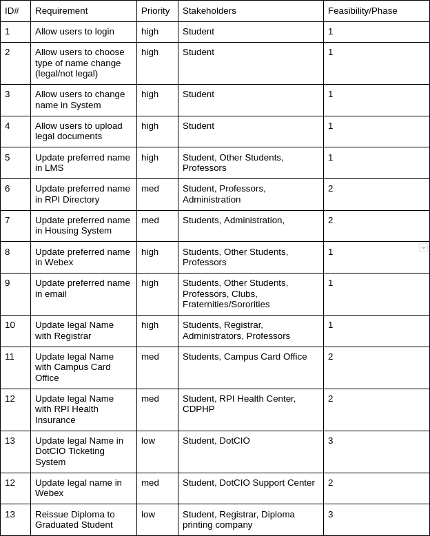

# Team Logistics

## Team Members

* Brooke Baer - Scribe. The Scribe records meeting minutes, as well as rendering deliverables in PDF format.
* Hao Jiang - Researcher. The Researcher is responsible to gather information of what software tools and design patterns may help with project development.
* Brass Perkins - Quality Assurance. Quality Assurance tests the project and makes certain that it meets design specifications.
* Ryan Lu - Team Leader. The Team Leader is responsible for team coordination and is the key point of contact for the team.
* Toluwaleke Semowo - [Role]. [Role Description]

## Team Name

The X Factor

## Logistical Changes from Deliverable 1

Extra meetings may occur when needed, otherwise meetings will occur as previousloy stated in deliverable 1.

## Success Criteria

1. Be on time to meetings, if this is not possible, let the team know you are going to be late. This is important because this way, everyone is updated on the process of our project's development.

2. Have what you promised to do done by the date you were assigned. This keeps everyone responsible for their own work and keeps us on track for the development of our project.

3. If having trouble with anything, ask in the Discord server for help from others. This helps save time for the person who is having an issue, and allows team members to provide different views on a problem.

4. Keep track of due dates. This helps us manage the amount of time we have to complete assignments, keeping us on track.

5. Be organized with all notes and code that is written. This is important, because this way, when a TA or Professor reads our notes, they can quickly know what we're doing. Additionally, it lets us keep track of our project details.

# Project Status Report

## Current State

On Schedule. We are keeping up with tasks assigned to us and making sure that we know where to go with our project.

## Issues Encountered

* Feasibility wasn't properly defined, as the TA doesn't know our background knowledge, resources, or abilities to make the project feasible.
* Not enough risks considered, such as authorization between systems, compatibility/stability of application, or uncertainty of time distribution.

## How Team Members Contributed to Deliverables

All team members contributed equally to completing deliverables, with each team member working on their expertise areas.

# Project Deliverables

## Changes from First Team Deliverable

### Feasibility

We have students who have worked with all of the name change systems at RPI, as well as enough knowledge in both desktop and web programming to be able to access all of the forms and properly deal with them. This project should be feasible as our abilities, resources, and background knowledge are all sufficient to develop a system to handle all of RPI's separate name change systems.

### Risks

We have identified more risks, we originally identified:

* Accidental removal from email lists, leading to missing essential information due to email not being properly updated
* Leakage of RPI login information or name-change related documentation.

We have further identified the following risks:

* Authorization between systems failing
* Instability of application leading to crashes or user frustration
* Uncertainty of time distribution in project making it difficult t% Please add the following required packages to your document preamble:
% 
## Use Case 2: Update Preferred Name in RPI's Directory

### Primary Actor

Student.

### Stakeholders and Interests

Student: Wants to update preferred name in RPI's directory.

Professors: Need to know what to call students in class.

Administration: Need to know student preferred name in order to properly address student.

### Success Scenario

1. Student selects preferred name change in system.
2. Student logs into application with RCSID and password.
3. Student inputs preferred name.
4. System changes preferred name in RPI's directory.

### Extensions

4a: Student enters incorrect RCSID and/or password, student returns to step 2.

4b: Student misspells preferred name, return to step 3.

4c: Directory name change page is down, use case fails.

### Preconditions

Student is a student at RPI.

Student has a directory entry.

### Minimal Guarantees

Student is still a student.

Student still has a directory entry.

### Success Guarantees

Student's name is updated in RPI's directory.

\pagebreak

## Use Case 3: Update Preferred Name in RPI's Housing System

### Primary Actor

Student.

### Stakeholders and Interests

Student: Wants to update preferred name in RPI's housing system.

Administration: Need to know student preferred name in order to properly address student.

### Success Scenario

1. Student selects preferred name change in system.
2. Student logs into application with RCSID and password.
3. Student inputs preferred name.
4. System changes preferred name in RPI's housing system

### Extensions

4a: Student enters incorrect RCSID and/or password, student returns to step 2.

4b: Student misspells preferred name, return to step 3.

4c: Housing system name page is down, use case fails.

### Preconditions

Student is a student at RPI.

Student is in RPI's housing system.

### Minimal Guarantees

Student is still a student.

Student is still in RPI's housing system.

### Success Guarantees

Student's name is updated in RPI's housing system.

\pagebreak

## Use Case 4: Update Preferred Name in Submitty

### Primary Actor

Student.

### Stakeholders and Interests

Student: Wants to update preferred name in Submitty.

Other Students: Need to know how to refer to their classmates.

Professors: Need to know what to call student.

### Success Scenario

1. Student selects preferred name change in system.
2. Student logs into appliation with RCSID and password.
3. Student inputs preferred name into application.
4. Application accesses Submitty's name update function and updates name.

### Extensions

4a: Student enters incorrect RCSID and/or password, student returns to step 2.

4b: Student enters incorrect preferred name, student returns to step 3.

4c: Submitty is down, use case fails.

### Preconditions

Student is a student.

Student has a Submitty account.

### Minimal Guarantees

Student is still a student.

Student still has a Submitty account.

### Success Guarantees

Student is still a student.

Student's name is updated in Submitty.

\pagebreak

## Use Case 5: Update Preferred Name in WebEx

### Primary Actor

Student.

### Stakeholders and Interests

Student: Wants to update preferred name in WebEx.

Other Students: Need to know how to refer to their classmates.

Professors: Need to know what to call student.

### Success Scenario

1. Student selects preferred name change in system.
2. Student logs into application with RCSID and password.
3. Student inputs preferred name into application.
4. System inputs preferred name into WebEx profile.

### Extensions

4a: Student enters incorrect RCSID and/or password, student returns to step 2.

4b: Student enters incorrect preferred name, student returns to step 3.

4c: WebEx is down, use case fails.

### Preconditions

Student is a student.

Student has a WebEx account.

### Minimal Guarantees

Student is still a student.

Student still has a WebEx account.

### Success Guarantees

Student is still a student.

Student's name is updated in WebEx.

\pagebreak

## Use Case 6: Update Preferred Name in Email

### Primary Actor

Student.

### Stakeholders and Interests

Student: Wants to update preferred name in email.

Other Students: Need to know how to refer to their classmates.

Professors: Need to know what to call student.

Clubs: Need to know best name to refer to student.

Fraternities/Sororities: Need to know best name to refer to student.

### Success Scenario

1. Student selects preferred name change in system.
2. Student logs into application with RCSID and password.
3. Student inputs preferred name into application.
4. System inputs preferred name into Roundcube.

### Extensions

4a: Student enters incorrect RCSID and/or password, student returns to step 2.

4b: Student enters incorrect preferred name, student returns to step 3.

4c: Roundcube is down, use case fails.

### Preconditions

Student is a student.

Student has an email address.

### Minimal Guarantees

Student is still a student.

Student still has an email address.

### Success Guarantees

Student is still a student.

Student's name is updated in Roundcube.

\pagebreak

## Use Case 7: Update Legal Name with Registrar 

### Primary Actor

Student.

### Stakeholders and Interests

Student: Wants to update legal name in administrative database.

Registrar: Updates legal name.

Other Administrators: Need to know legal name for financial aid, bursar, etc.

Professors: Need to know what to call student.

### Success Scenario

1. Student selects legal name change in system.
2. Student logs into application with RCSID and password.
3. Student uploads legal documentation detailing name change into system.
4. Student inputs legal name into system.
5. System sends automated email to registrar.
6. Registrar verifies legal documentation.
7. Registrar updates name in administrative database.

### Extensions

5a: Student enters incorrect RCSID and/or password, student returns to step 2.

6a: Student provides insufficient/incorrect documentation, registrar notifies student, student returns to step 3.

6b: Registrar doesn't recieve email, use case fails.

### Preconditions

Student is a student.

### Minimal Guarantees

Student is still a student.

### Success Guarantees

Student is still a student.

Student's name is updated in updated in administrative database.

\pagebreak

## Use Case 8: Update Legal Name with Campus Card Office

### Primary Actor

Student.

### Stakeholders and Interests

Student: Wants to update legal name on ID card.

Campus Card Office: Updates name on ID card, issues new ID card.

### Success Scenario

1. Student selects new ID card in system.
2. Student is linked to campus card name change form.
3. Student completes form, including legal documentation.
4. Campus card office recieves and processes name change request form.
5. Campus card office prints new ID card
6. Campus card office alerts Student via email.

### Extensions

3a: Form is down, use case fails.

4a: Student provides incorrect information on form, campus card office does not approve form, return to step 3.

### Preconditions

Student is a student.

Student has legally changed their name with the registrar.

### Minimal Guarantees

Student is still a student.

### Success Guarantees

Student is still a student.

Student receives a new ID card.

\pagebreak

## Use Case 9: Update Legal Name with RPI Health Insurance

### Primary Actor

Student.

### Stakeholders and Interests

Student: Wants to update legal name on CDPHP insurance card.

RPI Health Center: Updates name in RPI's health insurance database.

CDPHP: Updates name on CDPHP insurance card after RPI Health Center updates health insurance database.

### Success Scenario

1. Student selects legal name change in system.
2. Student logs into application with RCSID and password.
3. Student uploads legal documentation detailing name change into system.
4. Student inputs legal name into system.
5. System sends automated email to RPI Health Center.
6. RPI Health Center verifies legal documentation.
7. RPI Health Center updates name in Health Center database.
8. CDPHP updates name in CDPHP's database.

### Extensions

5a: Student inputs incorrect login information, return to step 2.

6a: Student provides insufficient/incorrect documentation, RPI Health Center notifies student, student returns to step 3.

6b: RPI Health Center doesn't recieve email, use case fails.

### Preconditions

Student is a student.

### Minimal Guarantees

Student is still a student.

### Success Guarantees

Student is still a student.

Student's name is updated in updated in RPI Health Center Database.

Student's name is updated on their CDPHP insurance card.

\pagebreak

## Use Case 10: Update Legal Name in DotCIO Ticketing System

### Primary Actor

Student.

### Stakeholders and Interests

Student: Wants to update legal name in DotCIO ticketing system.

DotCIO Support Center: Updates name in DotCIO ticketing system.

### Success Scenario

1. Student selects legal name change in system.
2. Student logs into application with RCSID and password.
3. Student uploads legal documentation detailing name change into system.
4. Student inputs legal name into system.
5. Student inputs phone number.
6. DotCIO Support Center receives ticket.
7. DotCIO Support Center delegates staff member to handle ticket.
8. DotCIO Support Center verifies documentation
9. DotCIO Support Center changes student's legal name in ticketing system.

### Extensions

6a: Student inputs incorrect login information, return to step 2.

6b: Ticketing system is down, use case fails.

8a: Student provides insufficient/incorrect documentation, DotCIO Support Center notifies student, student returns to step 3.

### Preconditions

Student is a student.

### Minimal Guarantees

Student is still a student.

### Success Guarantees

Student is still a student.

Student's name is updated in DotCIO ticketing system.

\pagebreak

## Use Case 11: Update Legal Name in WebEx

### Primary Actor

Student.

### Stakeholders and Interests

Student: Wants to update legal name in WebEx.

DotCIO Support Center: Updates name in WebEx.

### Success Scenario

1. Student selects legal name change in system.
2. Student logs into application with RCSID and password.
3. Student uploads legal documentation detailing name change into system.
4. Student inputs legal name into system.
5. Student inputs phone number.
6. DotCIO Support Center receives ticket.
7. DotCIO Support Center delegates staff member to handle ticket.
8. DotCIO Support Center verifies documentation
9. DotCIO Support Center changes student's legal name in WebEx.

### Extensions

6a: Student inputs incorrect login information, return to step 2.

6b: Ticketing system is down, use case fails.

8a: Student provides insufficient/incorrect documentation, DotCIO Support Center notifies student, student returns to step 3.

### Preconditions

Student is a student.

### Minimal Guarantees

Student is still a student.

### Success Guarantees

Student is still a student.

Student's name is updated in WebEx.

\pagebreak

## Use Case 12: Reissue Diploma to Graduated Student

### Primary Actor

Former student.

### Stakeholders and Interests

Former student: Wants reissued diploma.

Registrar: Needs to order new diploma.

Diploma Printing Company: Need to know name to print on new diploma, ships diploma to student.

### Success Scenario

1. Student selects diploma reissue in system.
2. Student is provided with diploma reorder form.
3. Student fills out diploma reorder form.
4. Student notarizes form.
5. Student returns form, old diploma, and payment to Registrar.
6. Registrar receives form, old diploma, and payment.
7. Registrar confirms form is filled out properly and notarized.
8. Registrar puts in order for new diploma.
9. Printing company prints diploma.
10. Printing company sends diploma to student.

### Extensions

6a. Form is lost in mail, use case fails.

6b. If student doesn't return diploma, Registrar informs student. Either student returns to step 6, or if student still doesn't return diploma, Registrar continues and informs student that new diploma will be marked as duplicate.

7a: Student fills out form incorrectly, Registrar informs former student, return to step 3.

7b: Student doesn't properly notarize form, Registrar informs former student, return to step 4.

### Preconditions

Student has graduated.

Student has received a diploma.

### Minimal Guarantees

Student was a student.

### Success Guarantees

Student was a student.

Student receives updated diploma.

## Table of Requirements

## Deployment Diagram

## Domain Model Diagram

## Project Schedule and Work Breakdown Structure

* Complete Team Deliverable 2 - 10/19
* Begin work on design deliverable - 10/19
* Continue working on design deliverable - 10/26
* Continue working on design deliverable - 11/2
* Complete design deliverable - 11/9
* Begin work on implementation - 11/9
* Continue working on implementation - 11/16
* Start working on Team Presentation - 11/16
* Continue working on implementation & Team Presentation - 11/23
* Complete implementation - 11/30
* Continue working on Team Presentation - 11/30
* Complete Team Presentation - 12/3
* Begin work on Team Deliverable 5 - 11/30
* Continue working on Team Deliverable 5 - 12/7
* Complete work on Team Deliverable 5 - 12/14

